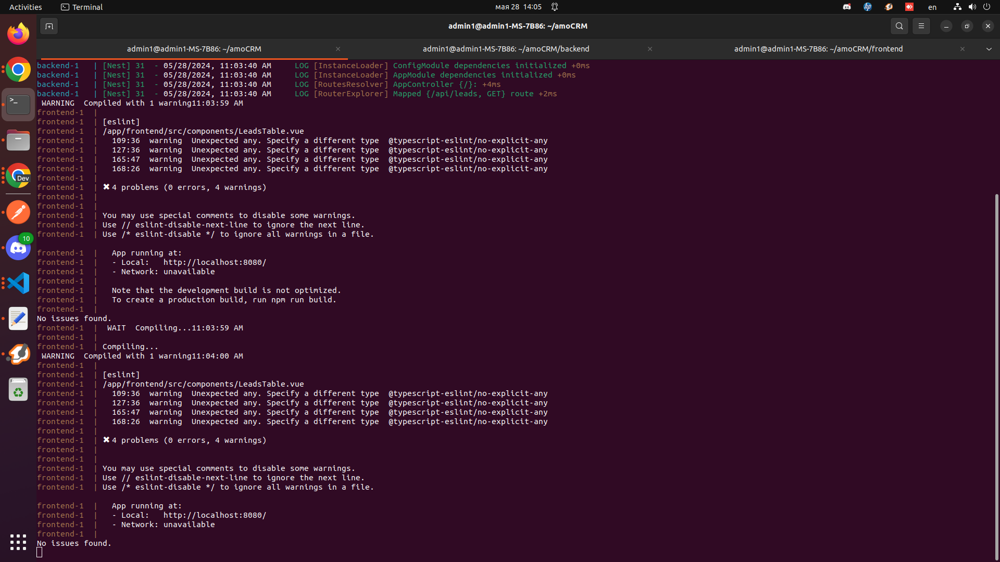
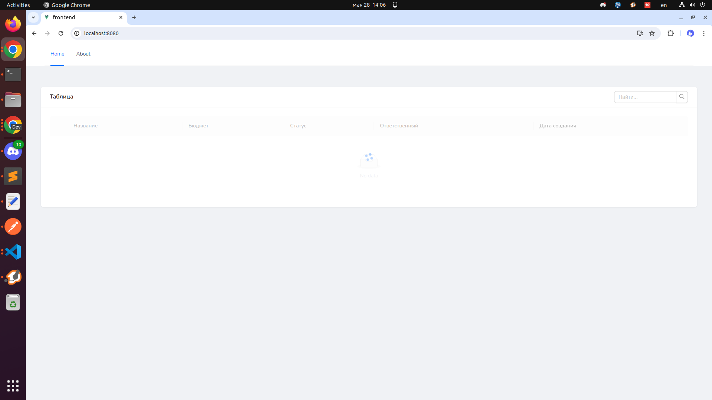
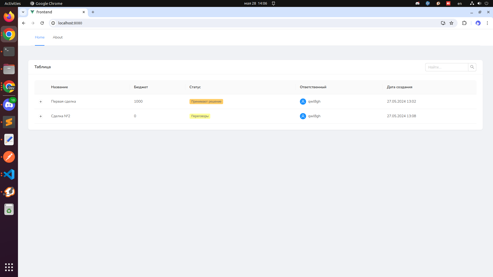
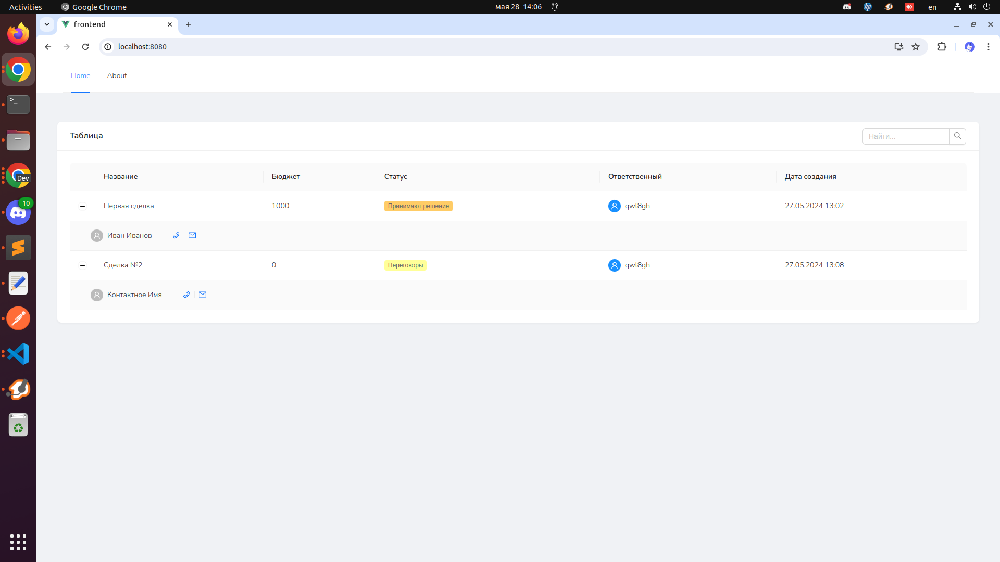
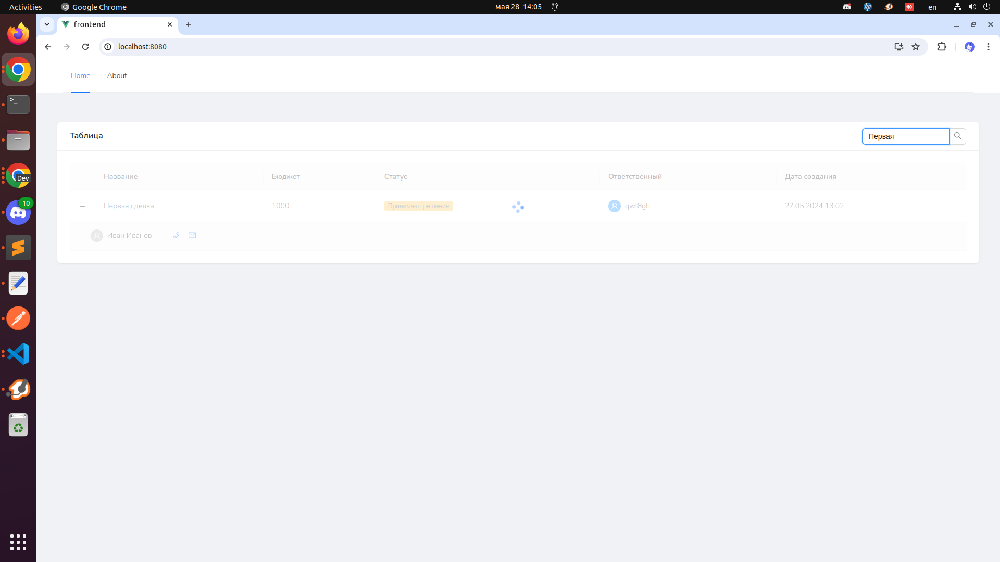
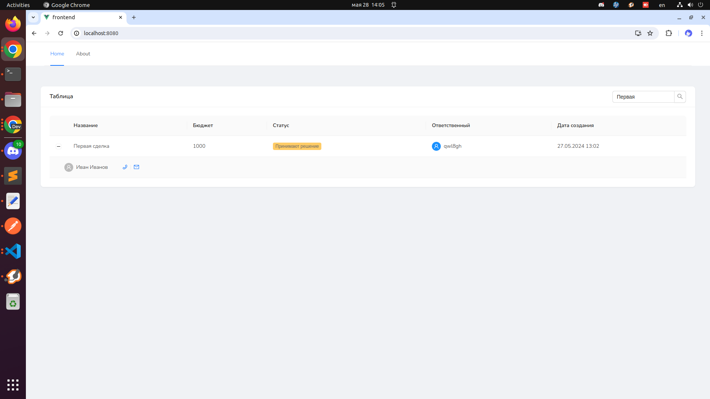

```
sudo kill -9 $(sudo lsof -t -i:3000)
sudo kill -9 $(sudo lsof -t -i:8080)
```

- locally:

```
cd backend
npm install
npm run start
```

```
cd frontend
npm install
npm run serve
```

- dockers:

```
docker compose up
```



http://localhost:8080/


||||
|:---:|:---:|:---:|
||||


